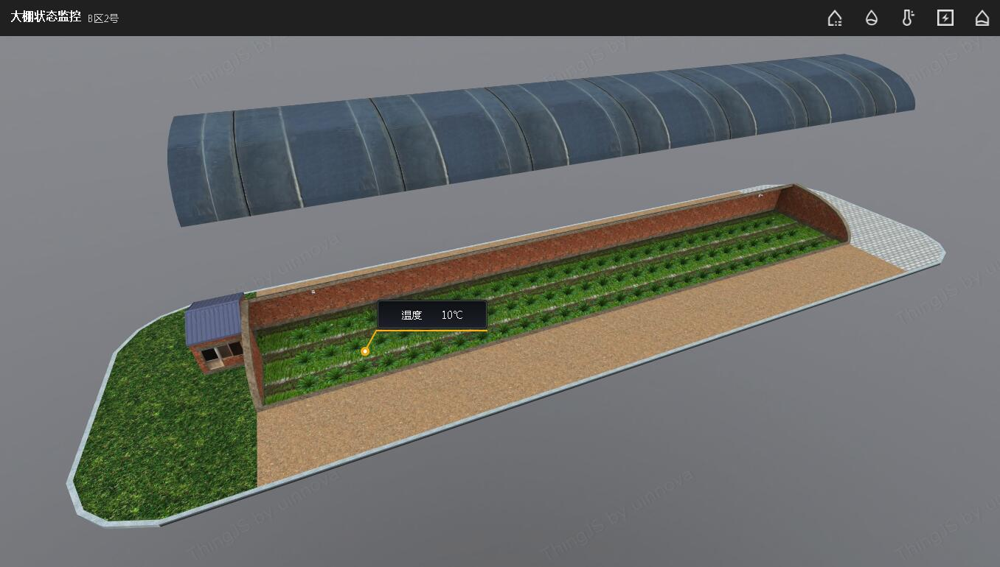
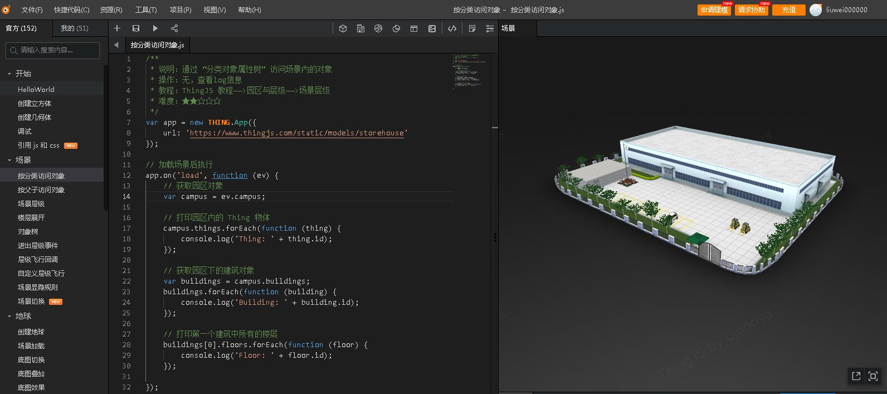
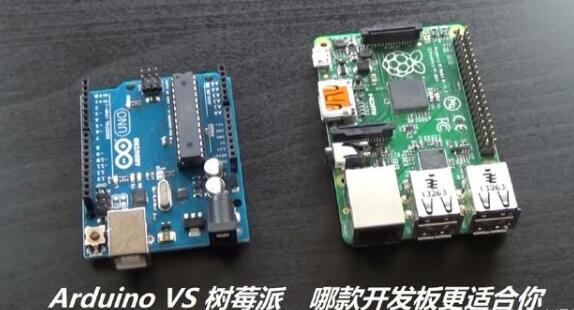
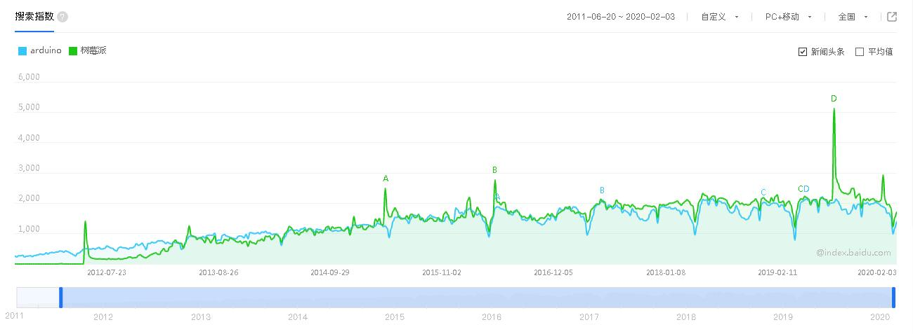
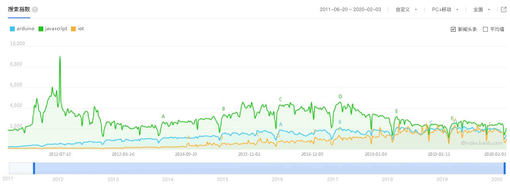

# ThingJS的Arduino物联网教程

    本教程是优锘科技针对ThingJS平台推出的arduino物联网教程。  
    帮助大家使用Arduino套件完成最基础的物联网Demo  

## ThingJS平台

* 解决3D呈现问题  

ThingJS平台能够解决物联网系统的呈现问题，例如，一个蔬菜大棚系统可以做成如下的3D样子  
  

* 通过JS代码实现场景交互  

在ThingJS平台上能够很方便的通过JavaScript代码实现对3D场景的交互操作，从而实现3D物联网系统  
ThingJS平台在线开发  
  
综合Demo如下： [蔬菜大棚Demo地址](https://www.thingjs.com/s/51e6457f7774c9ac9d97634c "蔬菜大棚Demo地址")

* ThingJS缺什么  

ThingJS平台包含3D操作API库，包含3D地图工具，场景搭建工具，图标搭建工具。在目前而言ThingJS平台并不包含物联网硬件。  
在经过多方调研后，最终选用开源硬件Arduino作为ThingJS平台的硬件对接。  
ThingJS通过和Arduino硬件的对接，最终可以完成完整的物联网应用。

## 开源硬件

 因为是一个平台产品所以在硬件平台选择上尽量选用通用性广，容易获得，价格低廉的硬件产品。  
在开源硬件中有两款开源硬件产品可作为备选平台：  
1. Arduino
2. 树莓派  

Arduino项目始于2003年，之后一直不温不火，2011年开源运行和创客运动兴起后，由于Arduino的易用性和简便性，逐渐进入创客圈的视野，之后交互艺术的兴起又进一步的推动了Arduino的发展。  

树莓派项目始于2006年，也因2011年的开源运行和创客运动，被广大创客们认识。  

  

## 树莓派 vs Arduino 

树莓派和Arduino的对比如下：  

|比较|树莓派|Arduino|
|-|-|-|
|主频    |1G+|20M|
|内存    |512M+|2k|
|存储空间|外置SD卡,4G+|32k|
|操作系统|linux|无|
|编程语言|python,c++,c...|C语音|
|外设    |usb,hdmi等|引脚io连接|
|应用    |计算类应用|控制类应用|
|价格    |~300RMB|~50RMB|  

可以看到arduino和树莓派定位有很大差异，是在两个层面的硬件平台。
Arduino偏控制类应用，软件相对简单，无负责的计算需求。
树莓派偏计算类应用，需安装操作系统，软件相对复杂。  

百度指数的关键词分析:

  

从百度指数看，2012年开源运动之后，Arduino和树莓派的搜索热度几乎相同，这也说明了Arduino和树莓派都是同一领域不同层面，可以互补的两款开源硬件。

## 为什么选Arduino

1. 物联网应用大部分是控制类应用
2. 更简单，上手更快
3. 成本低，入门门槛低
4. 使用广泛。  

下图为Arduino，JavaScript，Iot等关键词的百度指数：  
  

从Arduino，JavaScript，Iot的关键词的百度指数对比可以看出
Arduino的活跃度在2012之后急速上升和JavaScript，Iot的热度相当。

## 小结

1. ThingJS平台解决物联网系统的呈现问题，聚焦3D。
2. ThingJS平台需要硬件来完成完整的物联网应用。
3. Arduino是上手快，使用广泛的，成本低的开源硬件平台。
