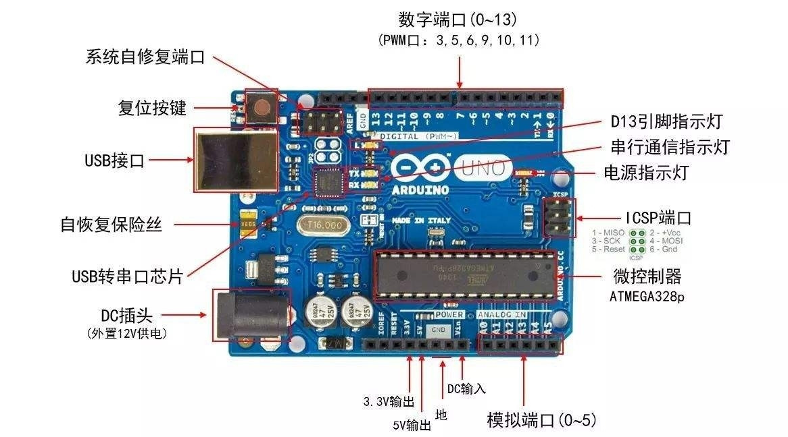
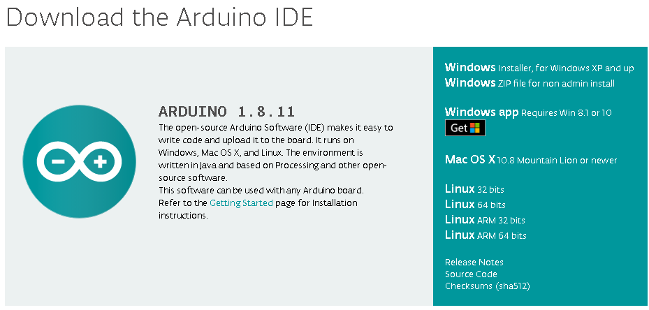
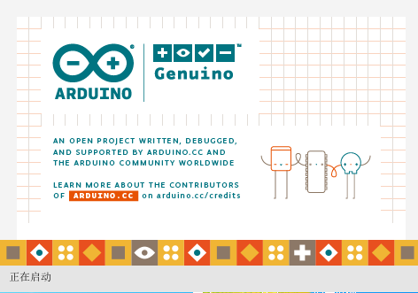
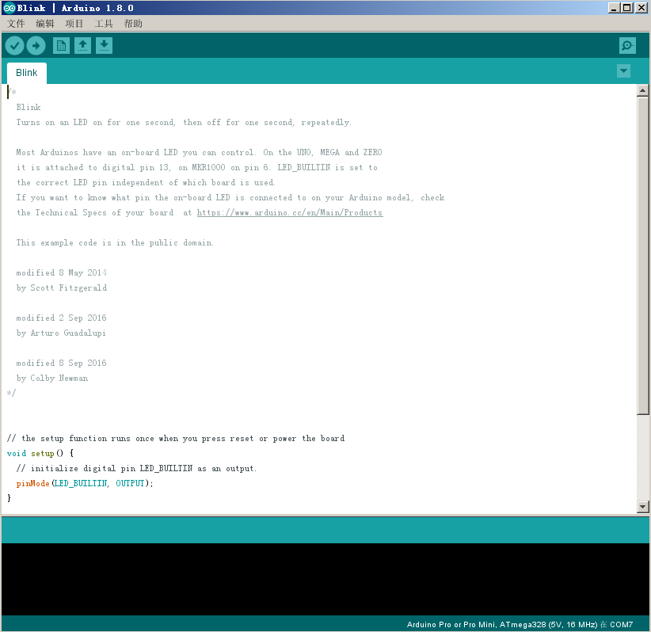
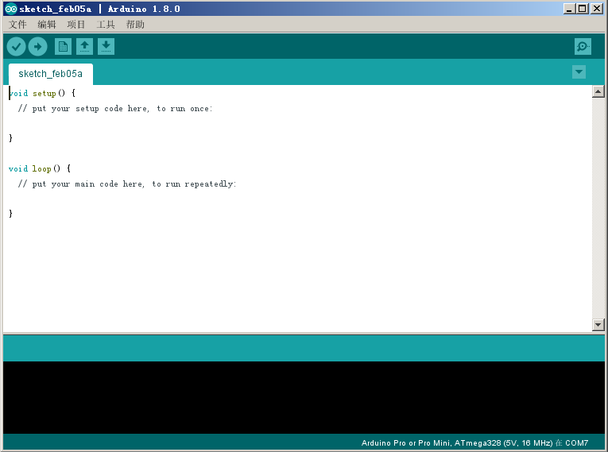
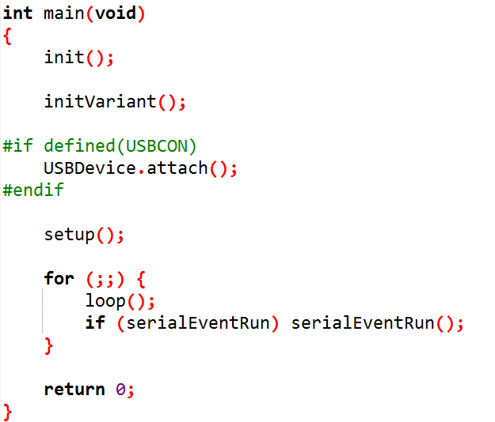

# 快速入门

Arduino需要同时理解硬件和软件才能开始编程，下面先看下Arduino开发板。

## 初识开发板

开发板各部分说明图  
  
开发板分为： 复位按键，电源接口，IO接口，指示灯。  
IO接口分为：数字接口和模拟接口  
Arduino通过软件控制IO接口的电平，从而和物理世界的传感器关联。  

## 安装IDE开发环境

在Arduino官网可以下载IDE软件  
一键到底安装  
  

安装完之后双击启动  
 

IDE打开后如下  
 

## setup 和 loop

新建一个Arduino项目，如下图所示:  
  

可以看到Arduino编程有两个重要的函数 setup函数和loop函数。  
Setup函数的代码只执行一次，通常用于做初始化操作。  
loop函数的代码会一直循环执行，通常用来写真正的业务逻辑。    

下图显示setup和loop的C语言的底层实现  
 

## 第一个程序

```arduino
/*
  Blink
  Turns on an LED on for one second, then off for one second, repeatedly.

  Most Arduinos have an on-board LED you can control. On the UNO, MEGA and ZERO 
  it is attached to digital pin 13, on MKR1000 on pin 6. LED_BUILTIN is set to
  the correct LED pin independent of which board is used.
  If you want to know what pin the on-board LED is connected to on your Arduino model, check
  the Technical Specs of your board  at https://www.arduino.cc/en/Main/Products
  
  This example code is in the public domain.

  modified 8 May 2014
  by Scott Fitzgerald
  
  modified 2 Sep 2016
  by Arturo Guadalupi
  
  modified 8 Sep 2016
  by Colby Newman
*/


// the setup function runs once when you press reset or power the board
void setup() {
  // initialize digital pin LED_BUILTIN as an output.
  pinMode(LED_BUILTIN, OUTPUT);
}

// the loop function runs over and over again forever
void loop() {
  digitalWrite(LED_BUILTIN, HIGH);   // turn the LED on (HIGH is the voltage level)
  delay(1000);                       // wait for a second
  digitalWrite(LED_BUILTIN, LOW);    // turn the LED off by making the voltage LOW
  delay(1000);                       // wait for a second
}
```