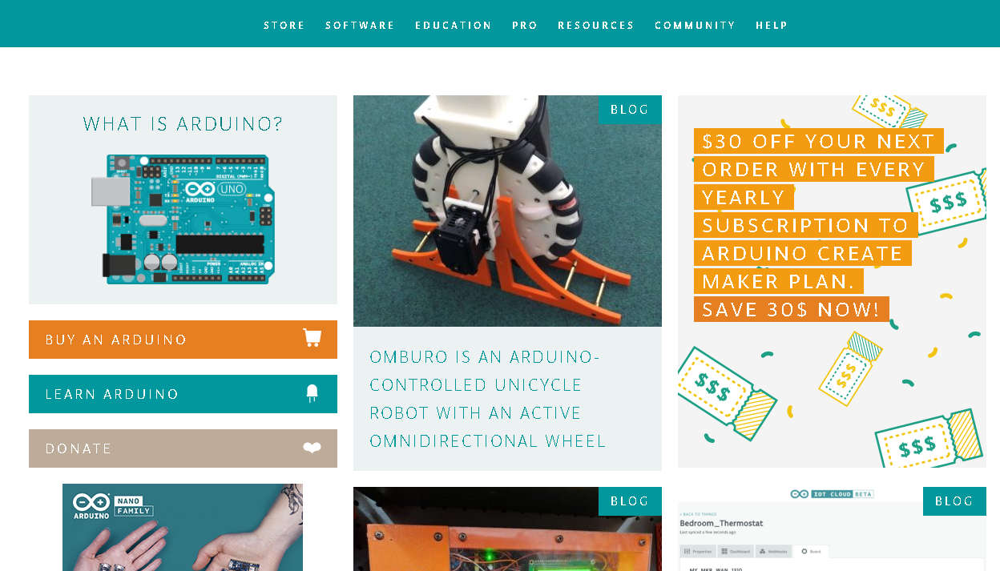

# Arduino介绍

Arduino是一家制作开源硬件和开源软件的公司，同时兼有项目和用户社区，该公司负责设计和制造单板微控制器和微控制器套件，用于构建数字设备和交互式对象。以便在物理和数字世界中感知和控制对象。  

   

Arduino产品是按照GNU宽通用公共许可证（LGPL）或GNU通用公共许可证（GPL）[1]许可的开源硬件和软件分发的，Arduino允许任何人制造Arduino板和软件分发。 Arduino板可以以预装的形式商业销售，也可以作为DIY套件购买。  

正是由于其开源的的商业模式，使得Arduino获得了巨大成功。

Arduino Logo  
   

Arduino 社区logo  
  

Arduino做的小制作都可以看成一个简单的自动控制装置。一个简单自动控制的装置，通常会有三个元素，输入、控制和输出。输入设备来搜集信号，控制器对接收到的信号进行处理、最后再由输出设备输出信号。我们以人来说， 五感就是输入信号，把信号送到大脑，大脑再做出反应，输出的就是人的行为。
   

## Arduino的历史

  

Arduino项目正式启动于2003年  
2003年的原型开发版如下：  
   

Arduino今天的五大应用  
  

## Arduino产品

Arduino UNO  
   
UNO是第一款arduino的流行型号，淘宝上的价格在30-100元左右。产品参数如下  
  

Arduino Pro Mini
Arduino Pro Mini是国内改进的，因其极低的成本，价格在10-20元左右受到广泛好评。
   
Arduino Pro Mini 的产品参数如下  
  

## Arduino官网

[https://www.arduino.cc/](https://www.arduino.cc/ "")   

## Arduino社区

[https://forum.arduino.cc/](https://forum.arduino.cc/ "")  

