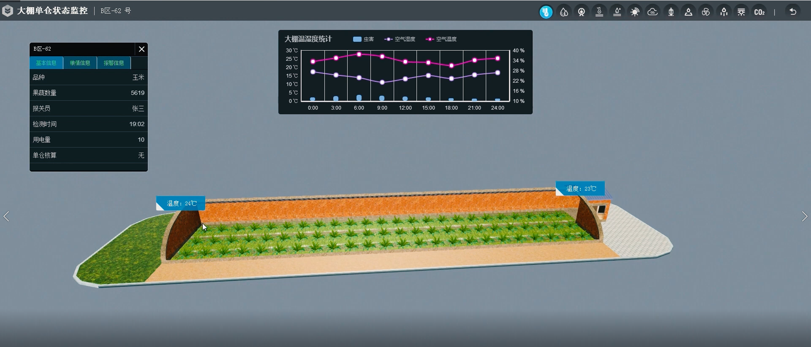

# 3D物联网Demo设计

## 蔬菜大棚方案

### 硬件选型

1. 主控板Arduino x1
2. ESP8266 x1
3. 温度传感器LM35 x2
4. 湿度传感器 x2
5. 水侵传感器 x2
6. 光照传感器 x2
7. IO扩展板 x1

### 3D场景

大棚场景：  
  

### 主要功能

1. 显示蔬菜大棚的基本信息：包括温度，湿度，光照，水位
2. 显示蔬菜大棚的温度，湿度等信息的历史曲线
3. 根据温度，湿度，光照等信息给出当前蔬菜大棚的适宜情况。

### 开发计划

1. 场景搭建   已有
2. 硬件接线   1天
3. 硬件软件开发及调试  2天
4. ThingJS开发  3天  
合计 6天

## 停车场管理方案

### 硬件选型

1. 主控板Arduino x1
2. ESP8266 x1
3. 光照传感器 x3
4. 小灯 x3
7. IO扩展板 x1

### 3D场景

停车场3D场景  
  

### 主要功能

1. 显示车位是否有车
2. 夜晚开启照明灯
3. 统计停车场的使用情况。

### 开发计划

1. 场景搭建   2天
2. 硬件接线   1天
3. 硬件软件开发及调试  2天
4. ThingJS开发  3天  
合计 8天