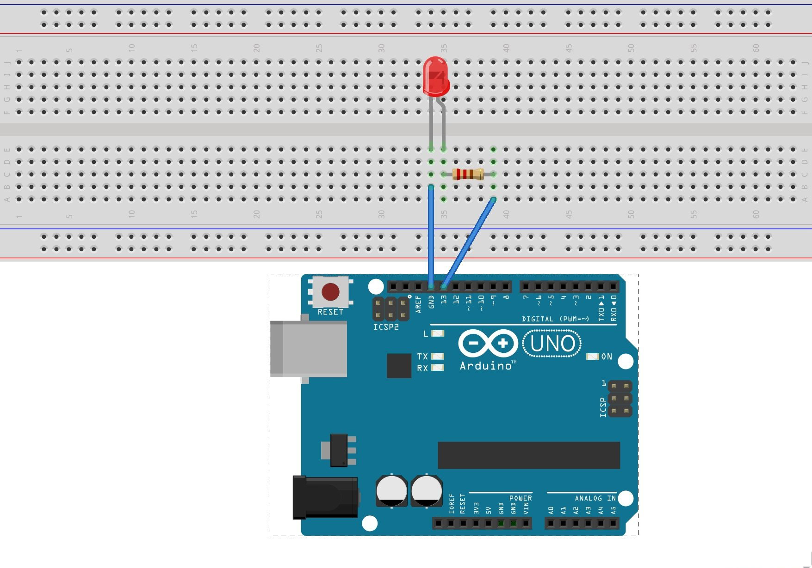
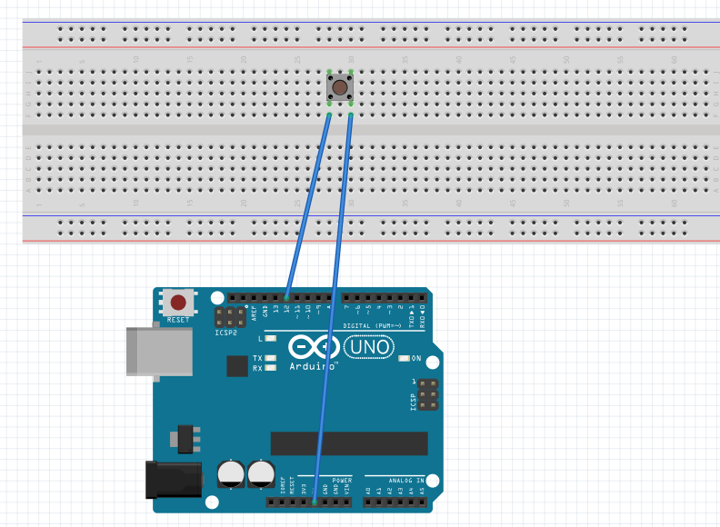
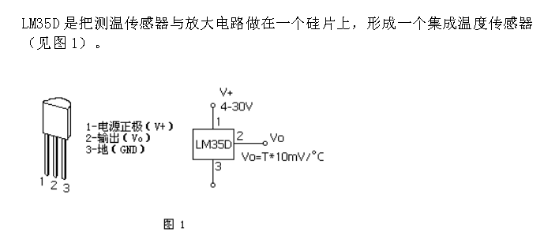
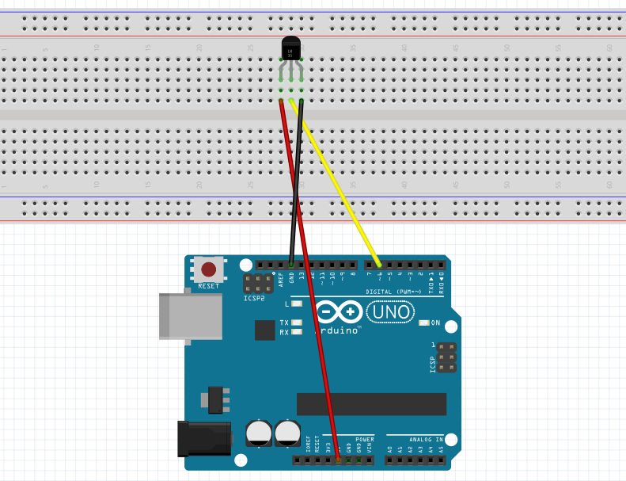
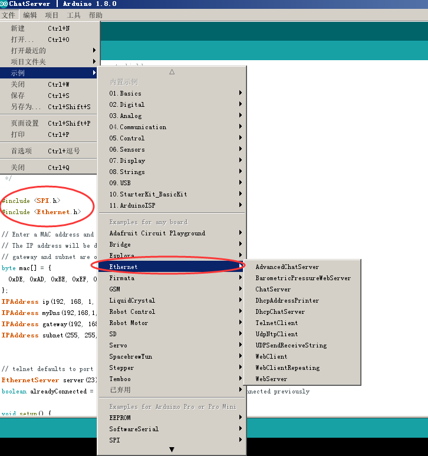

# 实战Arduino

本节介绍如何使用Arduino编写程序

## 硬件编程的基本思路

编写Arduino程序，首先需要确定硬件连线，然后在根据IO连接采样或者控制外部环境。  
  
如上图所示D13连接了二极管的正极，二极管的负极连接的GND。如果D13为高电平那么二极管就会亮，如果D13为低电平二极管就会灭。  
这样就可以通过软件来控制二极管的亮灭，如使用红色二极管，那么就可以用来代表告警信息。

代码如下：  

```arduino
void setup() {
  pinMode(13, OUTPUT);  //让13引脚成为输出口
}

// the loop function runs over and over again forever
void loop() {
  digitalWrite(13, HIGH);   // 设置高电平让灯亮
  delay(1000);                       // wait for a second
  digitalWrite(13, LOW);    // 设置低电平让灯灭
  delay(1000);                       // wait for a second
}
```

## 按键

Arduino除了可以做输出还可以做输入  
按键的连线图如下：  
  

最简单按键的代码如下：  
```arduino
void setup() {
  pinMode(12, INPUT);  //让13引脚成为输出口
}

// the loop function runs over and over again forever
void loop() {
  int b =  digitalRead(12); 
  if ( b == 1) {
    //当按键按下时
  } else {
    //当按键放开时
  }
}
```

## 温度采集实验

LM35系列产品是高精度集成电路温度器件，其输出电压与摄氏温度成线性正比关系。
LM35的数据手册如下  
  
可以看到1为正，2是输出，3是GND。  
连线图如下：  
  

```arduino
float temp = 0;


// the setup routine runs once when you press reset:
void setup() {
Serial.begin(115200);
Serial.println(F("reading temperature begin. \n"));

}

// the loop routine runs over and over again forever:
void loop() {
 
  static unsigned long sensortStamp = 0;
  
  if(millis() - sensortStamp > 100){
    sensortStamp = millis();
    // read the LM35 sensor value and convert to the degrees every 100ms.

    int reading = analogRead(6); //注意到我们是把LM35的输出端连接到了A6，所以这里是analogRead(6)
    temp = reading *0.0048828125*100;
    Serial.print(F("Real Time Temp: ")); 
    Serial.println(temp); 
  }
  
}
```

## 使用Arduino库

对于一些复杂的传感器Arduino提供了很多库函数，可以直接操作复杂的外设。
比如使用ISP协议的网卡就提供了库，和众多例子

  

