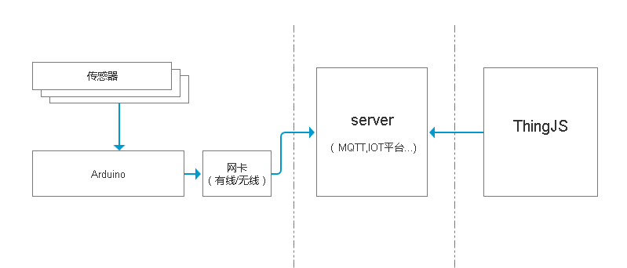
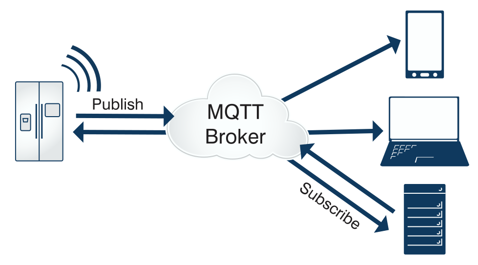

# Arduino和ThingJS平台结合

有了Arduino硬件之后，还需要将Arduino的硬件信息和ThingJS平台相结合。  
如何结合请看下面的Demo架构。  

## 如何将数据连接到ThingJS

Arduino和ThingJS结合和很多种方式，其中最简单的方式是通过MQTT server来做中间服务。  
系统架构图如下  
  

从上图可以看出  
1. Arduino接收众多硬件传感器的信息
2. 采集到数据后，通过网卡将数据传输到MQTT服务器
3. ThingJS平台直接从MQTT服务器拿数据
4. 最终实现硬件接入到ThingJS平台  

## Mqtt server

MQTT（Message Queuing Telemetry Transport，消息队列遥测传输协议），是一种基于发布/订阅（publish/subscribe）模式的"轻量级"通讯协议，该协议构建于TCP/IP协议上，由IBM在1999年发布。MQTT最大优点在于，可以以极少的代码和有限的带宽，为连接远程设备提供实时可靠的消息服务。作为一种低开销、低带宽占用的即时通讯协议，使其在物联网、小型设备、移动应用等方面有较广泛的应用。  

MQTT是一个基于客户端-服务器的消息发布/订阅传输协议。MQTT协议是轻量、简单、开放和易于实现的，这些特点使它适用范围非常广泛。在很多情况下，包括受限的环境中，如：机器与机器（M2M）通信和物联网（IoT）。其在，通过卫星链路通信传感器、偶尔拨号的医疗设备、智能家居、及一些小型化设备中已广泛使用。  

  

## websocket请求

由于前端页面不能直接和MQTT通讯，故需要将MQTT封装在websocket协议中。
这里可以选用Mosquitto作为MQTT server。

ThingJS中的MQTT通讯例子如下：  

```javascript

/**
 * 说明：
 * 直接连接MQTT服务器（需支持websocket访问）
 * 并将数据挂接到物体（car01）身上，与panel面板进行数据绑定
 * 难度：★★★★★
 */
// 引用第三方 mqtt 库，详见 https://github.com/mqttjs/MQTT.js
THING.Utils.dynamicLoad(['https://www.thingjs.com/static/lib/mqtt.js'], function () {
	init();
});

function init() {
	var app = new THING.App({
		url: 'https://www.thingjs.com/static/models/storehouse'
	});

	app.on('load', function () {
		var car = app.query('car01')[0];
		// 物体身上创建monitorData对象 用于存储动态监控数据
		car.monitorData = {
			'温度': ''
		};
		initMqtt(car)
		createPanel(car);
	})
}

/** ******************* 以下为MQTT数据对接 ********************/
// 测试使用的MQTT服务器为 Mosquitto （Mosquitto支持websocket的配置可自行百度）
// 设备端每隔4秒会向服务器 /public/TEST/dev1 发送一条温度数据
// 客户端订阅了/public/TEST/dev1主题
// 也可以通过其他MQTT客户端向服务器发送 /public/TEST/dev1 主题的消息，验证MQTT服务
// ws:www.3dmmd.cn:8088; wss:www3dmmd.cn:8086; tcp://www.3dmmd.cn:8089;

var client = null;
function initMqtt(obj) {
	// 如果网站是 https 接口则对应 wss
	// 如果网站是 http 接口则对应 ws 即可
	client = mqtt.connect("wss:www.3dmmd.cn:8086");
	client.subscribe("/public/TEST/dev1");
	client.on("message", function (topic, payload) {
		console.log('data:' + payload);
		obj.setAttribute("monitorData/温度", payload);
		changeColor(obj);
	});
}

// 停止请求数据
function stopUpdate() {
	if (client) client.end()
}

function createPanel(obj) {
	// 界面组件
	var panel = new THING.widget.Panel({
		titleText: 'car01温度',
		hasTitle: true
	});

	var monitorControl = panel.addBoolean({ 'isOpen': true }, "isOpen").caption("监控开关");
	// 将物体的monitor对象中的数据 与 panel 进行绑定
	panel.add(obj.monitorData, '温度').name('温度');

	monitorControl.on('change', function (ev) {
		if (ev) {
			initMqtt(obj);
		}
		else {
			stopUpdate();
		}
	})
}

// 如果温度>25 改变颜色
function changeColor(obj) {
	var value = obj.getAttribute("monitorData/温度");
	if (value > 25) {
		obj.style.color = 'rgb(255,0,0)';
	}
	else {
		obj.style.color = null;
	}
}

```