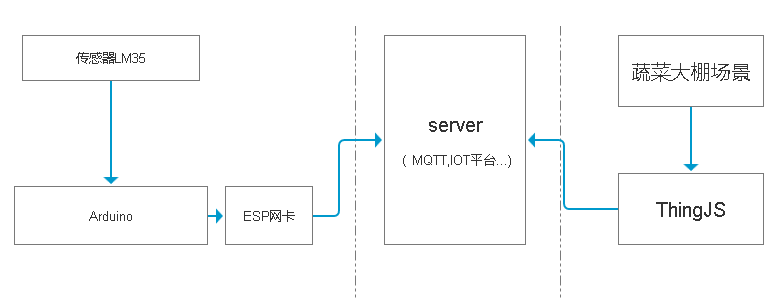

# 综合实验

下面来看一个综合Demo案例

## 需求定义

制作一个监控蔬菜大棚温度的Demo，能够显示蔬菜大棚中的温度数值。  

## 架构设计

  

硬件选型：  
1. 温度传感器LM35 x1
2. ESP8266 x1
3. 主控板Arduino x1

## Arduino代码

```arduino

//引入ESP8266库函数
#include <ESP8266WiFi.h>
#include <PubSubClient.h>

const char* ssid = "........";//WiFi的SSID
const char* password = "........";//WiFi的密码
const char* mqtt_server = "tcp://www.3dmmd.cn:8089";//MQTT的服务器地址

WiFiClient espClient;
PubSubClient client(espClient);

void setup_wifi() {
  delay(10);
   Serial.println();
  Serial.print("Connecting to ");
  Serial.println(ssid);

  WiFi.begin(ssid, password);
  while (WiFi.status() != WL_CONNECTED) {
    delay(500);
    Serial.print(".");
  }
  randomSeed(micros());

  Serial.println("");
  Serial.println("WiFi connected");
  Serial.println("IP address: ");
  Serial.println(WiFi.localIP());
}  //链接WiFi

void reconnect() {
  // Loop until we're reconnected
  while (!client.connected()) {
    Serial.print("Attempting MQTT connection...");
    // Create a random client ID
    String clientId = "ESP8266Client-";//该板子的链接名称
    clientId += String(random(0xffff), HEX);//产生一个随机数字 以免多块板子重名
    //尝试连接
    if (client.connect(clientId.c_str())) {
      Serial.println("connected");
    } else {
      Serial.print("failed, rc=");
      Serial.print(client.state());
      Serial.println(" try again in 5 seconds");
      // 如果链接失败 等待五分钟重新链接
      delay(5000);
    }
  }
}

void setup() {
  pinMode(BUILTIN_LED, OUTPUT);     // 将BUILTIN_LED引脚初始化为输出
  Serial.begin(115200);
  setup_wifi();
  client.setServer(mqtt_server, 1883);//MQTT默认端口是1883
  client.setCallback(callback);
}

void loop() {
  if (!client.connected()) {
    reconnect();
  }
  client.loop();

  int reading = analogRead(6); //注意到我们是把LM35的输出端连接到了A0，所以这里是analogRead(0)
  temp = reading *0.0048828125*100;

  char s[32];
  itoa(temp, s, 10);    //数字转字符串

  client.publish("/wendu", s);//链接成功后 会发布这个主题和语句

  delay(1000);
}

```

## ThingJS代码

```javascript
//加载场景代码
let app = null;
let client = null;

let data = {
    wendu: "10℃",
    //sshidu: "60%"
}

THING.Utils.dynamicLoad(['https://www.thingjs.com/static/lib/mqtt.js'], function () {
    app = new THING.App({
        // 场景地址
        "url": "/client/ThingJS/11606/20191214094914866283637",
        "skyBox": 'BlueSky' // 设置天空盒
    });
    //视角移动
    app.on('load', function (ev) {
        app.level.change(ev.campus);
        app.level.change(app.query(/C区-3/)[0],
        init();
    })

    b_init();
});

function b_init() {
    create_banner()
}

function initMqtt() {
    // 如果网站是 https 接口则对应 wss
    // 如果网站是 http 接口则对应 ws 即可
    client = mqtt.connect("wss:www.3dmmd.cn:8086");
    client.subscribe("/wendu");
    client.on("message", function (topic, payload) {
        console.log('data:' + payload);
        data.wendu = payload;
    });
}

function create_banner() {
    // 创建一个上通栏
    // 引入图片文件
    var baseURL = "https://www.thingjs.com/static/images/sliohouse/";
    var banner_top = THING.widget.Banner();
    // 数据对象 为通栏中的按钮绑定数据用
    var dataObj = {
        warehouseCode: false,
        temperature: false,
        humidity: false,
        statistics: false,
        status: false,
        orientation: false,
        cerealsReserve: false,
        video: true,
        cloud: true
    };

    var title = `<p style='color:#fff;position:absolute;left:15px;top:12px;font-weight: 600'>大棚状态监控</p><p style="color: #ccc;position:absolute;left: 120px;top: 16px;font-weight: 100;font-size: small;">B区2号</p>`
    $(banner_top.__ul).append($(title))
    $(banner_top.__ul).css({ 'justify-content': 'flex-end' })

    // 向上通栏中添加按钮
    var img0 = banner_top.addImageBoolean(dataObj, 'warehouseCode').caption('仓库编号').imgUrl(baseURL + 'warehouse_code.png');
    var img1 = banner_top.addImageBoolean(dataObj, 'temperature').caption('温度检测').imgUrl(baseURL + 'temperature.png');
    var img2 = banner_top.addImageBoolean(dataObj, 'humidity').caption('湿度检测').imgUrl(baseURL + 'humidity.png');
    var img3 = banner_top.addImageBoolean(dataObj, 'statistics').caption('能耗统计').imgUrl(baseURL + 'statistics.png');
    var img4 = banner_top.addImageBoolean(dataObj, 'status').caption('保粮状态').imgUrl(baseURL + 'cereals_reserves.png');
}


// 创建UIAnchor
function createUIAnchor(obj) {
    // 创建widget (绑定数据用)
    var panel = new THING.widget.Panel({
        // 设置面板宽度
        width: '150px',
        // cornerType 角标样式
        // 没有角标 none ，没有线的角标 noline ，折线角标 polyline
        cornerType: 'polyline'

    })

    // 绑定物体身上相应的属性数据

    panel.addString(data, 'wendu').caption('温度');
    //panel.addString(data, 'shidu').caption('湿度');


    // 创建UIAnchor面板
    var uiAnchor = app.create({
        // 类型
        type: 'UIAnchor',
        // 父节点设置
        parent: obj,
        // 要绑定的页面的 element 对象
        element: panel.domElement,
        // 设置 localPosition 为 [0, 0, 0]
        localPosition: [0, 0, 0],
        // 指定页面的哪个点放到localPosition位置上(百分比)
        pivot: [-0.2, 1.5]
    });
    return uiAnchor;
}

function init() {
    console.log('init');
    app.query(/./).pickable = false;
    createUIAnchor(app.query('#113119')[0]);
    initMqtt();
}


```